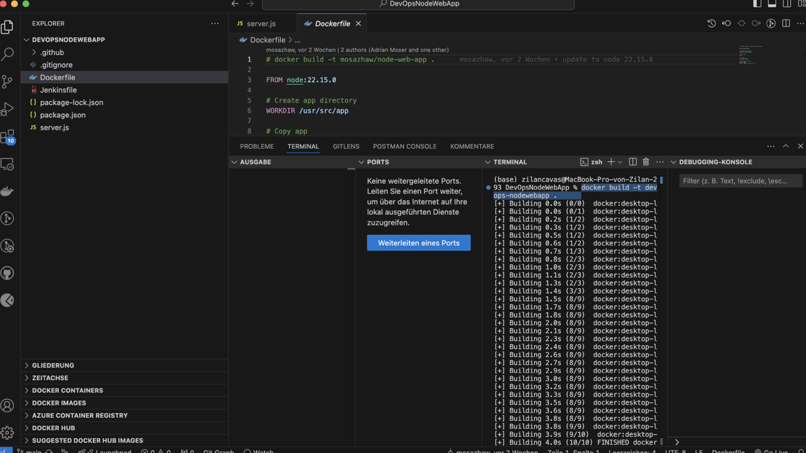
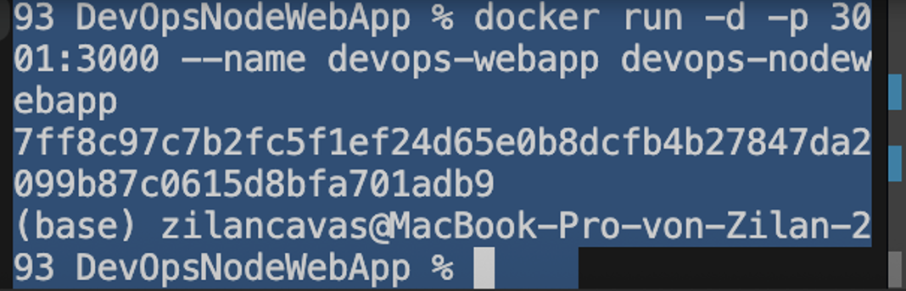
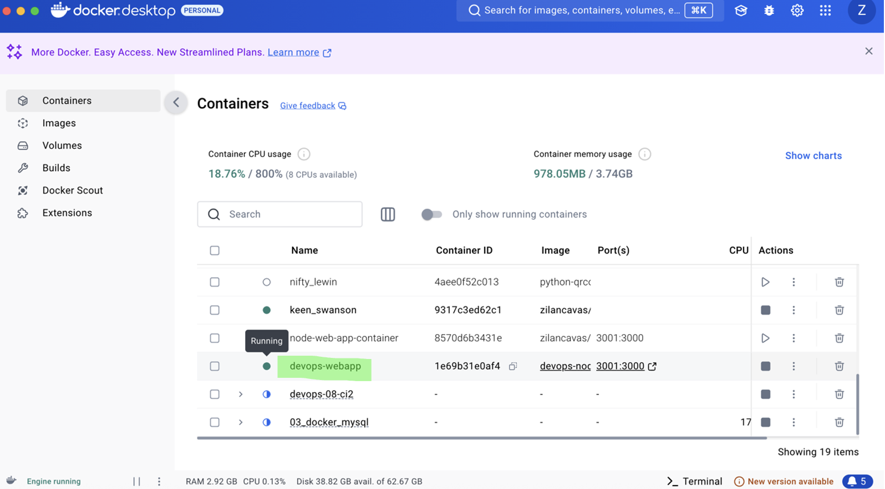
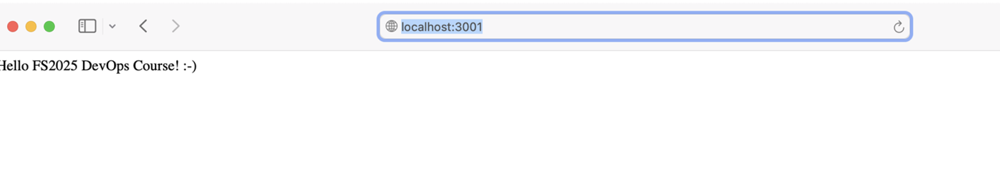
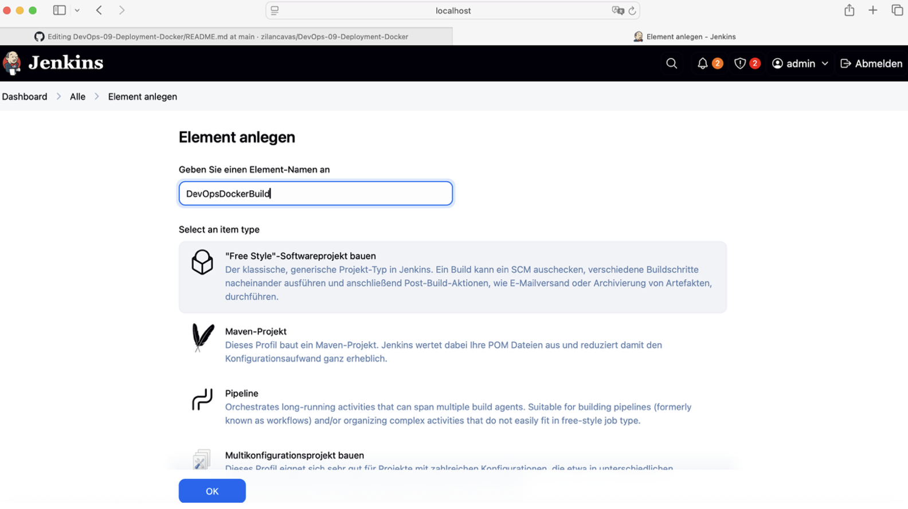
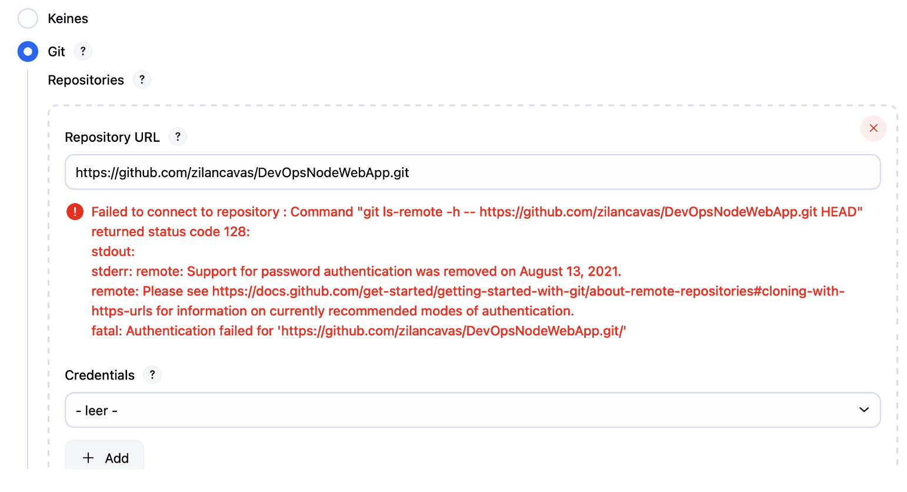
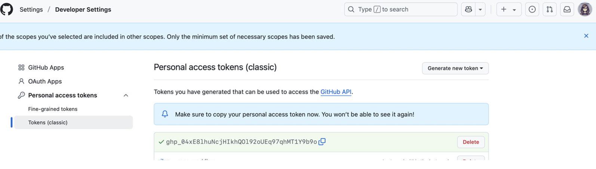
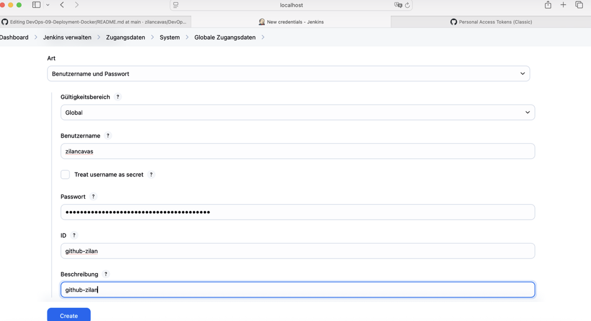
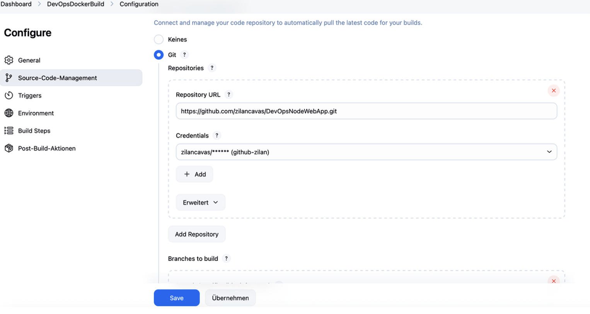
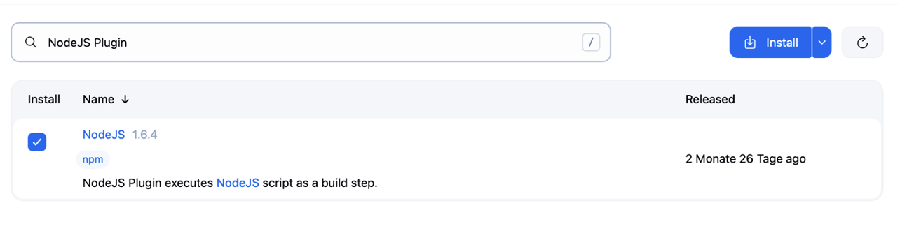

# DevOps 09 Deployment Docker

## Lernjournal
| Schritt | Beschreibung | Screenshot |
|--------|--------------|------------|
| 1 | Ich habe das Repository initialisiert und alle wichtigen Dateien wie `.gitignore`, `Dockerfile`, `Jenkinsfile`, `package.json` und `server.js` erstellt. |  |
| 2 | Ich habe die Startseite der Node.js-App im Browser über `localhost:3001` getestet. Die Seite zeigt die Nachricht „Hello FS2025 DevOps Course! :-)“. |  |
| 3 | Ich habe in VS Code das `Dockerfile` geöffnet und den Befehl `docker build -t devops-nodewebapp .` verwendet, um das Image lokal zu bauen. |  |
| 4 | Im `Dockerfile` wurde das offizielle Node.js-Image genutzt und der Arbeitsordner sowie die Quelldateien definiert. |  |
| 5 | Der Docker-Build wurde im Terminal erfolgreich abgeschlossen, alle Layer wurden gebaut und gecached. |  |
| 6 | Ich habe in Jenkins ein neues Freestyle-Projekt mit dem Namen `DevOpsDockerBuild` angelegt. |  |
| 7 | In Docker Desktop wurde der Container `devops-webapp` als „Running“ angezeigt – das bedeutet, dass mein Container erfolgreich gestartet wurde. |  |
| 8 | Ich habe den Container mit dem Befehl `docker run -d -p 3001:3000 --name devops-webapp devops-nodewebapp` ausgeführt. |  |
| 9 | Beim Versuch, mein GitHub-Repo mit Jenkins zu verbinden, trat ein Authentifizierungsfehler auf, da Passwort-Authentifizierung nicht mehr unterstützt wird. |  |
| 10 | Ich habe in GitHub unter Developer Settings einen „Personal Access Token (classic)“ generiert, um Jenkins-Zugang zu ermöglichen. |  |
