# DevOps 09 Deployment Docker

> **Hinweis:** Die Screenshots in diesem Lernjournal sind im Vergleich eher klein dargestellt. Vermutlich passt das Markdown-Rendering auf GitHub die Bildgrösse automatisch an die Spaltenbreite der Beschreibung an, weshalb sich die Darstellung nicht manuell anpassen liess.

## Lernjournal
| Schritt | Beschreibung | Screenshot |
|--------|--------------|------------|
| 1 | Ich habe das Repository initialisiert und alle wichtigen Dateien wie `.gitignore`, `Dockerfile`, `Jenkinsfile`, `package.json` und `server.js` erstellt. | 
| 2 | Nach dem erfolgreichen Build habe ich den Docker-Container gestartet. | 
| 3 | In Docker Desktop habe ich überprüft, ob der Container korrekt läuft. Mein Container `devops-webapp` war als „Running“ markiert, und der Port 3001:3000 wurde korrekt gemappt – ein Hinweis, dass die Anwendung erfolgreich im Container läuft. |  |
| 4 | Ich habe die Webanwendung erfolgreich im Browser geöffnet, indem ich `localhost:3001` aufgerufen habe. Die Ausgabe „Hello FS2025 DevOps Course! :-)“ bestätigt, dass der Container läuft und der Port richtig freigegeben wurde. |  |
| 5 | In Jenkins habe ich ein neues Projekt mit dem Namen `DevOpsDockerBuild` erstellt. Dabei habe ich den klassischen „Freestyle“-Typ gewählt, um individuelle Build-Schritte konfigurieren zu können. |  |
| 6 | Beim Einrichten der Git-Verbindung in Jenkins trat ein Authentifizierungsfehler auf. Der Zugriff auf das GitHub-Repository war nicht möglich, da GitHub keine Passwort-Authentifizierung mehr unterstützt. |  |
| 7 | Um das Authentifizierungsproblem zu lösen, habe ich in den GitHub Developer Settings einen **Personal Access Token (classic)** generiert. Dieser Token ermöglicht die sichere Authentifizierung für Jenkins oder andere Tools, die auf mein GitHub-Repository zugreifen sollen. |  |
| 8 | In Jenkins habe ich die Zugangsdaten für GitHub hinterlegt. Dabei habe ich meinen Benutzernamen und den zuvor generierten **Personal Access Token** als Passwort verwendet. |  |
| 9 | In Jenkins habe ich im **Source Code Management** erfolgreich das GitHub-Repository eingebunden und meine gespeicherten Zugangsdaten (`github-zilan`) ausgewählt. Dadurch kann Jenkins nun automatisiert auf den Repository-Inhalt zugreifen. |  |
| 10 | Um Node.js-Projekte in Jenkins korrekt bauen zu können, habe ich das **NodeJS Plugin** installiert. Dieses Plugin ermöglicht es, Node.js-Skripte als Build Steps auszuführen. |  |
| 11 | In der Jenkins-Umgebung habe ich **Node.js 20.11.1** als Build-Umgebung konfiguriert. Dazu habe ich „Provide Node & npm bin/ folder to PATH“ aktiviert, damit Jenkins `node` und `npm` korrekt ausführen kann. | 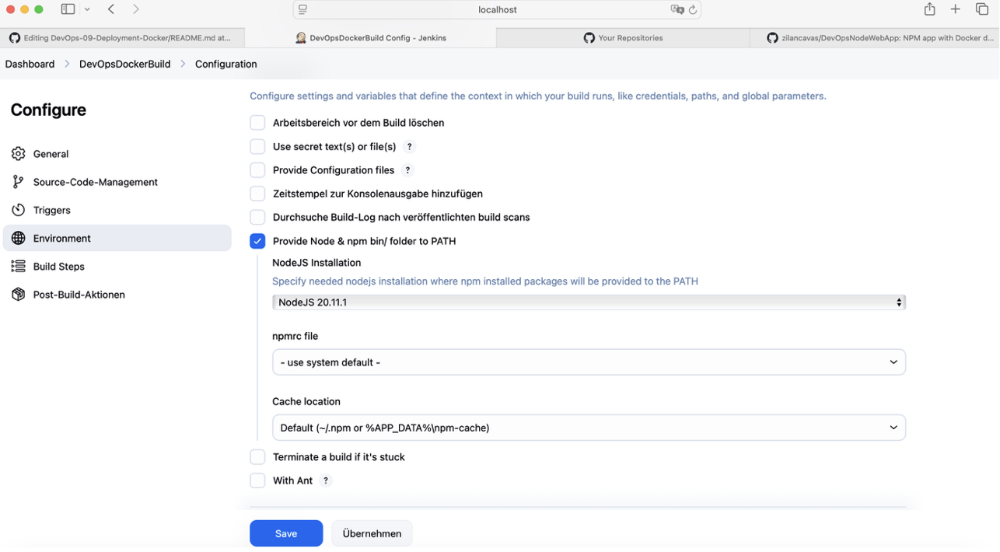 |
| 12 | Im Bereich „Build Steps“ habe ich den Befehl `npm install` als Shell-Befehl hinzugefügt. Damit stellt Jenkins sicher, dass alle Node.js-Abhängigkeiten vor dem Build automatisch installiert werden. | 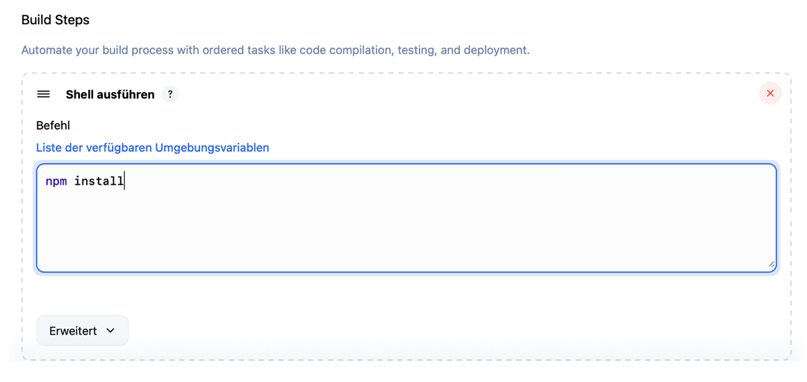 |
| 13 | Um Docker-Befehle aus Jenkins heraus verwenden zu können, habe ich einen socat-Container gestartet. Dieser leitet den Docker-Socket weiter, sodass Jenkins in einem Container mit dem Host-Docker kommunizieren kann. | 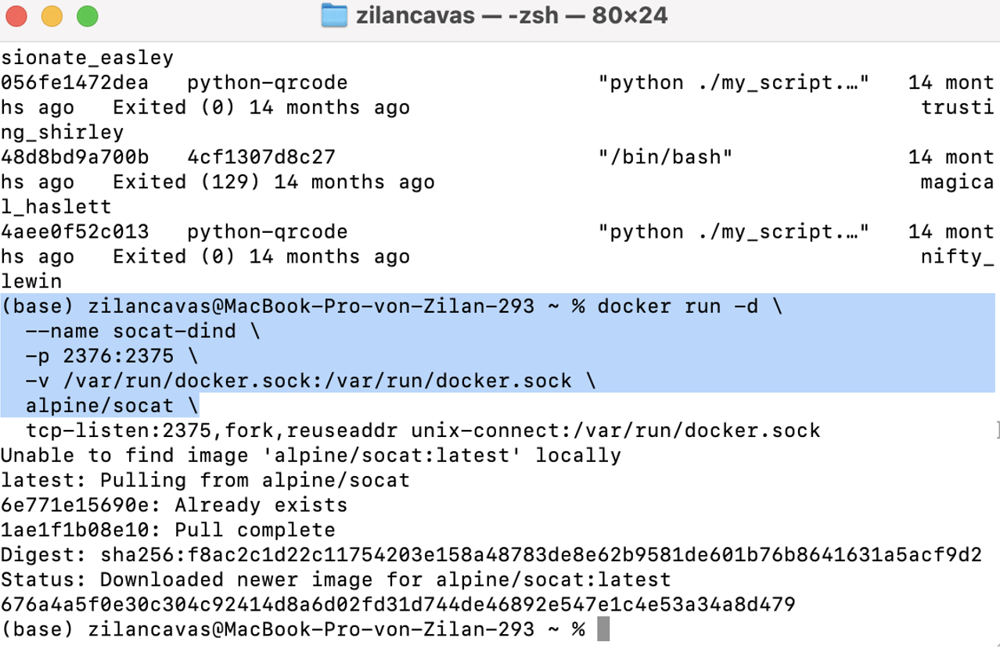 |
| 14 | In den Jenkins-Einstellungen habe ich die Docker-URL konfiguriert. Durch die Verbindung zu `tcp://host.docker.internal:2375` kann Jenkins nun über das socat-Relay auf den Docker-Daemon zugreifen. | 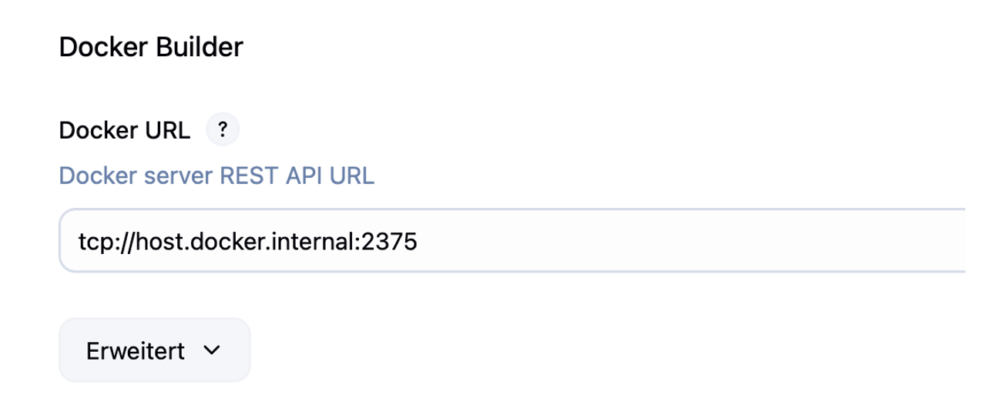 |
| 15 | In Jenkins habe ich zwei Docker-Kommandos als Build Steps definiert. Zuerst wird das alte Image `zilancavas/node-web-app` gelöscht. Danach wird mit dem aktuellen Workspace ein neues Image mit demselben Tag erstellt. | 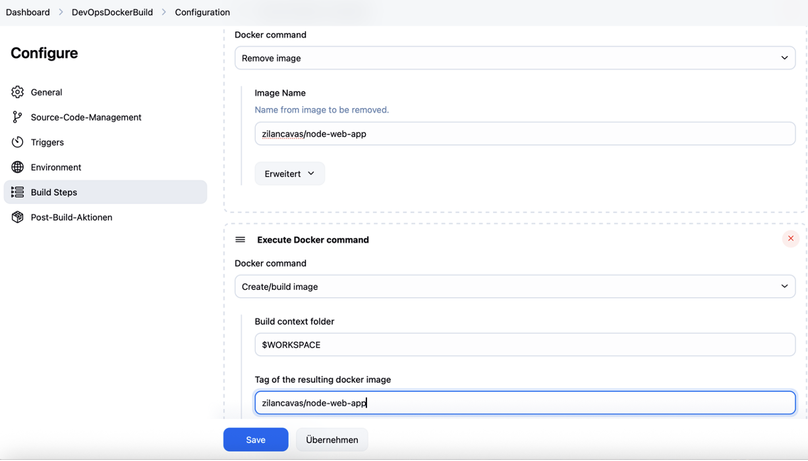 |
| 16 | Der zweite Build war erfolgreich! Jenkins zeigt unter „DevOpsDockerBuild“ an, dass Build #2 stabil und erfolgreich war. Vorheriger Build #1 ist hingegen fehlgeschlagen. | 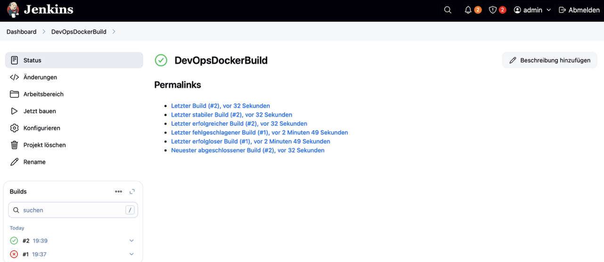 |
| 17 | Im Anschluss konnte ich in Docker Desktop überprüfen, dass das Image `zilancavas/node-web-app` erfolgreich erstellt wurde. Es ist mit dem Tag `latest` versehen und wurde vor wenigen Minuten generiert. | 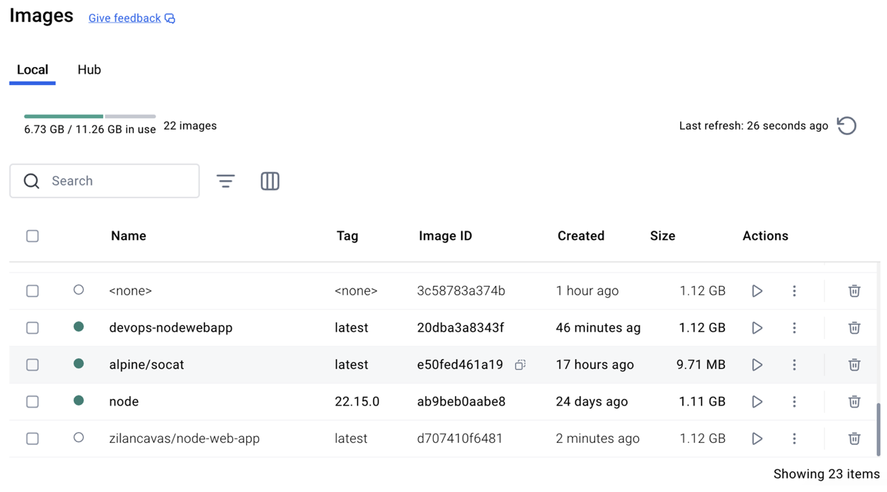 |
| 18 | In Jenkins habe ich im Build-Step den automatischen Befehl hinzugefügt, um den alten Container `node-web-app-container` zu entfernen. Dabei habe ich die Optionen `Remove volumes` und `Force remove` aktiviert, damit der Container inklusive seiner Volumes zuverlässig gelöscht wird. | 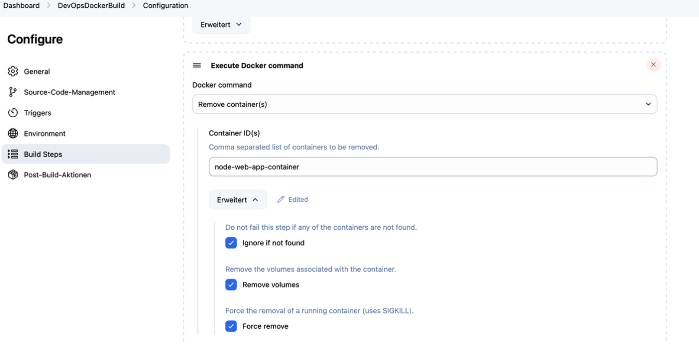 |
| 19 | Ich habe erfolgreich einen neuen Build in Jenkins ausgelöst. Der Build #3 wurde manuell gestartet und lief fehlerfrei durch. | 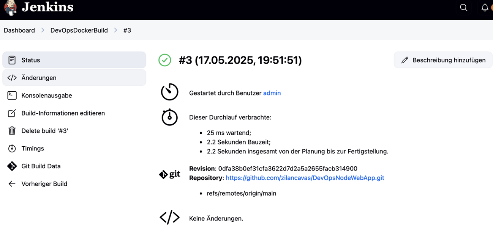 |
| 20 | In Jenkins habe ich einen weiteren Build Step hinzugefügt, um die Docker-Container nach dem Build automatisch zu starten. | 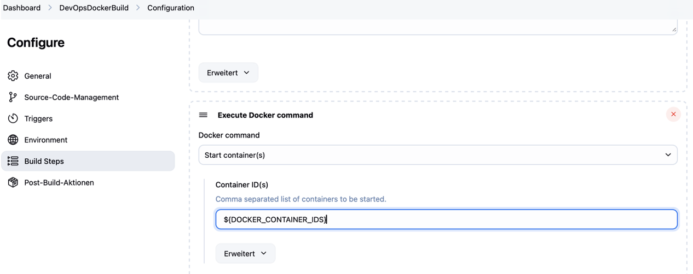 |
| 21 | Abschliessend habe ich im Jenkins-Job eine Post-Build-Aktion definiert, um die Docker-Container nach dem Build automatisch zu stoppen. Die Option „Remove Stopped Containers“ habe ich nicht aktiviert, da die Container erhalten bleiben sollen. | 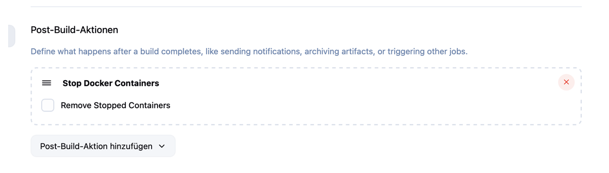 |
| 22 | Der Build #9 wurde erfolgreich in Jenkins ausgeführt. | 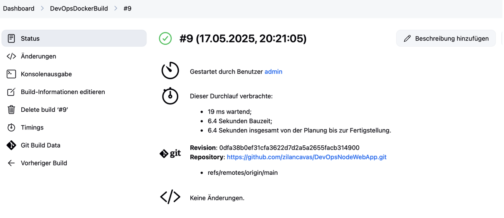 |
| 23 | In Jenkins habe ich einen Trigger eingerichtet, der den Build automatisch startet, sobald ein anderes Projekt erfolgreich abgeschlossen wurde. | 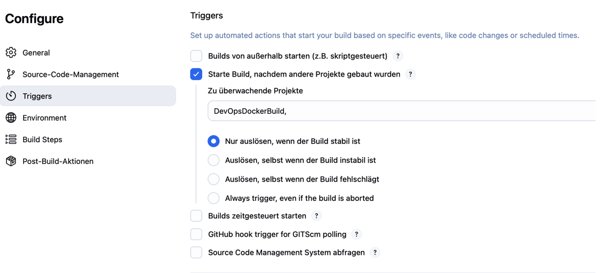 |
| 24 | Ich habe einen zeitgesteuerten Build-Trigger in Jenkins konfiguriert. Dabei fragt Jenkins das Source Code Management System alle 2 Minuten nach Änderungen ab. | 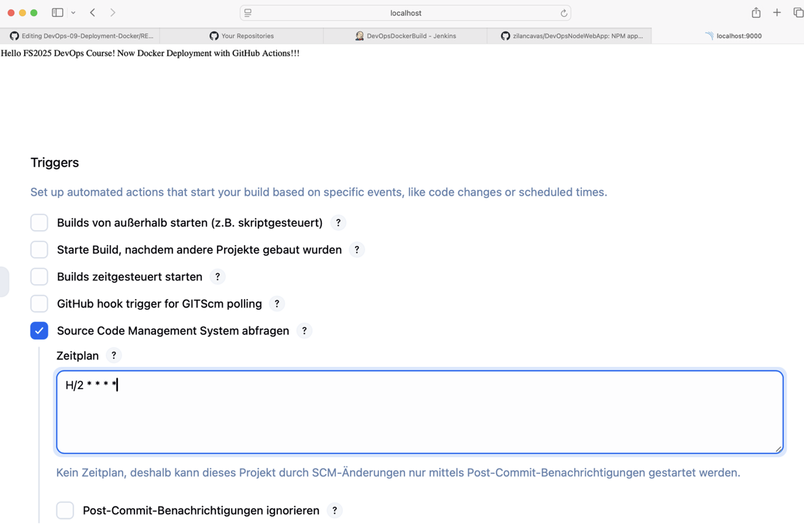 |
| 25 | Dann habe ich überprüft, ob die Anwendung erfolgreich auf `localhost:9000` läuft. | 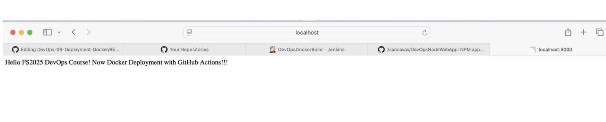 |
| 26 | Ich habe erneut eine Teständerung an der Datei `server.js` vorgenommen. Die Nachricht auf der Startseite wurde zu „Teständerung von Zilan – läuft alles automatisch?“ angepasst. | 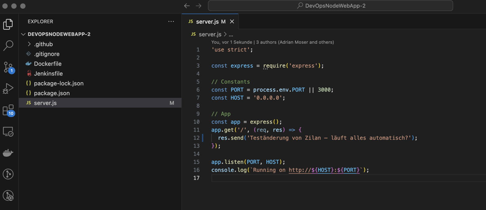 |
| 27 | Ich habe die Änderung in der `server.js` committed und per `git push` ins Repository übertragen.| 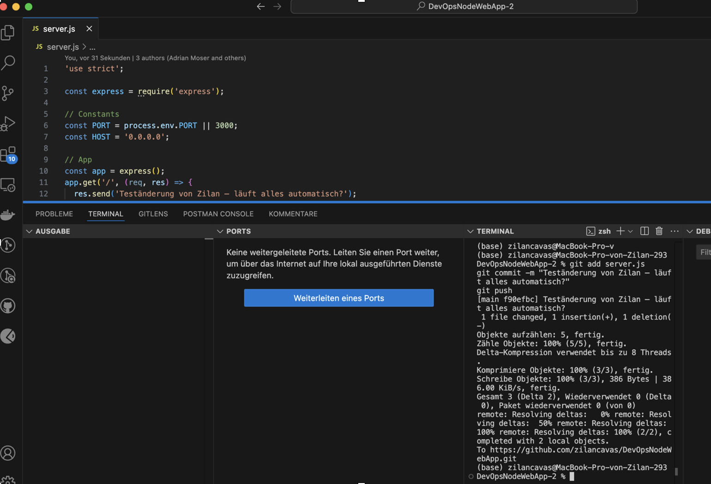 |
| 28 | Ich habe im Docker Hub einen neuen Personal Access Token mit dem Namen `jenkins-push` erstellt. Dieser wird benötigt, um über Jenkins Images in mein Docker-Repository zu pushen.| 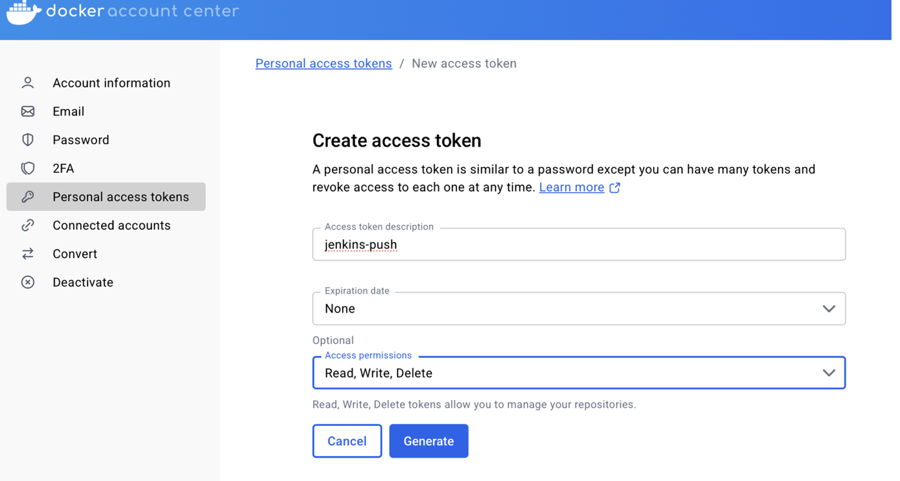 |
| 29 | Ich habe mein lokal erstelltes Docker-Image zuerst mit dem Befehl `docker tag` umbenannt und anschliessend mit `docker push` erfolgreich in mein öffentliches Docker Hub Repository hochgeladen. | 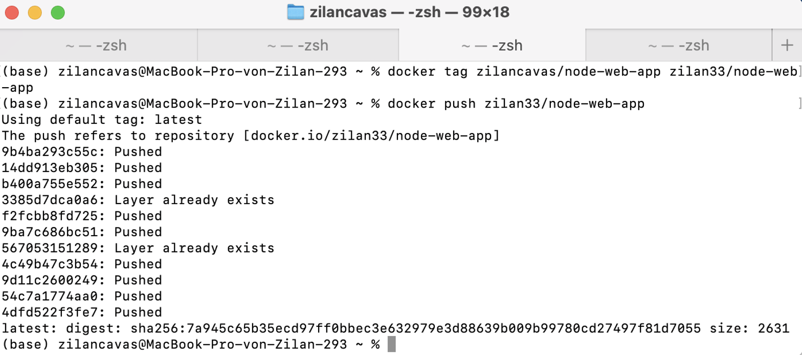 |
| 30 | Ich habe das erstellte Docker-Image in mein Docker Hub Repository `zilan33/node-web-app` gepusht. | 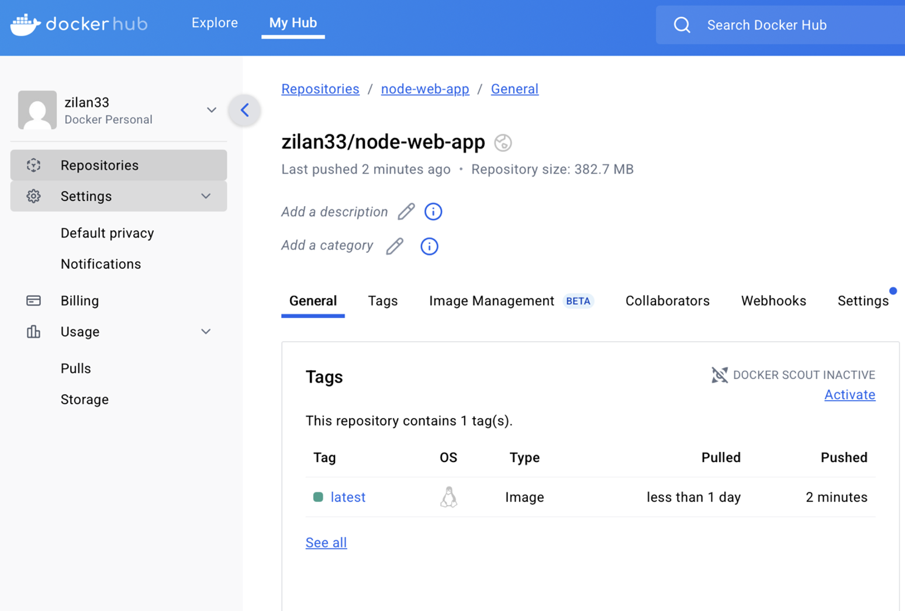 |
| 31 | Ich habe mein Docker-Image erfolgreich mit GitHub Actions deployed. Der Log zeigt, dass der Upload abgeschlossen wurde und der Service unter der Adresse `http://0.0.0.0:10000` live ist. Die Meldung „Your service is live“ bestätigt, dass der Deployment-Prozess erfolgreich war. | 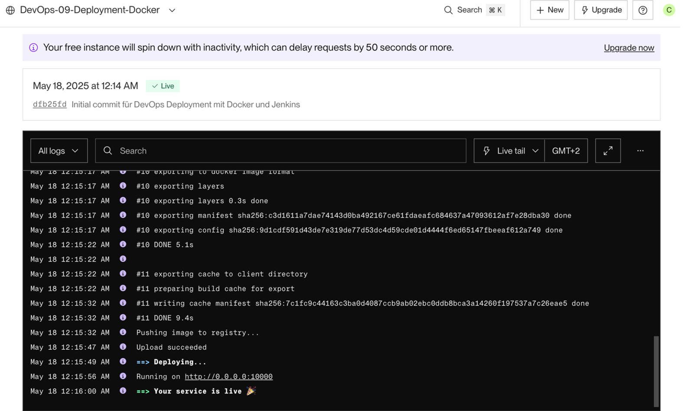 |
| 32 | Ich habe mein Projekt so konfiguriert, dass der Deployment-Prozess auf [Render](https://render.com) erfolgt. Das bedeutet, dass mein Service nach einem erfolgreichen Build automatisch als Live-Service bereitgestellt wird.| 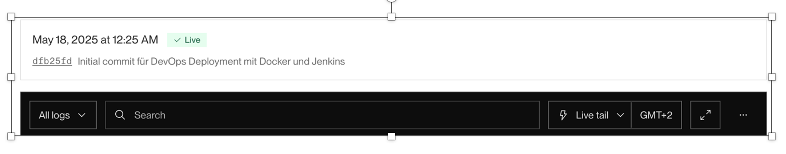 |
| 33 |Nach dem erfolgreichen Deployment auf Render konnte ich die Ausgabe meiner geänderten `server.js` direkt auf der Live-Seite `devops-09-deployment-docker.onrender.com` sehen. |  |

## Fazit
Das neunte Lernjournal war mit Abstand das herausforderndste von allen bisherigen Modulen. Der Aufbau einer vollständigen CI/CD-Pipeline mit **Jenkins**, **Docker**, **GitHub** und **Render** erforderte nicht nur technisches Verständnis, sondern auch viel Geduld und Troubleshooting-Fähigkeiten.

### Herausforderungen
Während der Umsetzung traten mehrere Schwierigkeiten auf:
- Die **Integration von Docker mit Jenkins** war komplexer als erwartet. Besonders die Konfiguration der **Docker Daemon-Verbindung über Port 2375**, das Setzen der richtigen **Credentials**, und das Verständnis für das Zusammenspiel von Images, Containern und Jenkins-Build-Steps kosteten viel Zeit.
- Auch die **Authentifizierung gegenüber GitHub und DockerHub** brachte anfangs einige Fehlermeldungen mit sich, bis die richtigen Tokens und Zugriffsrechte korrekt gesetzt waren.
- Die **automatische Portfreigabe in VS Code** sowie die Sichtbarkeit der Commits und Docker-Ereignisse im Repository erforderten viel Aufmerksamkeit.
- Der letzte Schritt - **Live-Deployment mit Render** – war ebenfalls neu und erforderte zusätzliche Recherche, insbesondere was die Docker-Registry und das automatisierte Deployment angeht.

### Was ich gelernt habe
Trotz (oder gerade wegen) dieser Schwierigkeiten war der Lerneffekt enorm:
- Ich verstehe nun, wie man eine Node.js-Anwendung in ein Docker-Image verpackt und containerisiert.
- Ich habe gelernt, wie man **Build- und Deployment-Jobs in Jenkins** Schritt für Schritt aufsetzt – inklusive Vor- und Nachaktionen.
- Ich weiss jetzt, wie man **DockerHub** als zentrale Registry einbindet und wie ein **automatisiertes Deployment** auf Plattformen wie Render funktioniert.
- Ganz besonders habe ich den **Zusammenhang zwischen Code-Änderung, Commit, Image-Build, Push und Deployment** verstanden – also den kompletten DevOps-Prozess in der Praxis durchlaufen.

Auch wenn dieser Teil sehr zeitintensiv und stellenweise frustrierend war, konnte ich durch das selbstständige Arbeiten mein Verständnis für **automatisiertes Software Deployment** deutlich vertiefen. Der Aufwand hat sich gelohnt :-)
